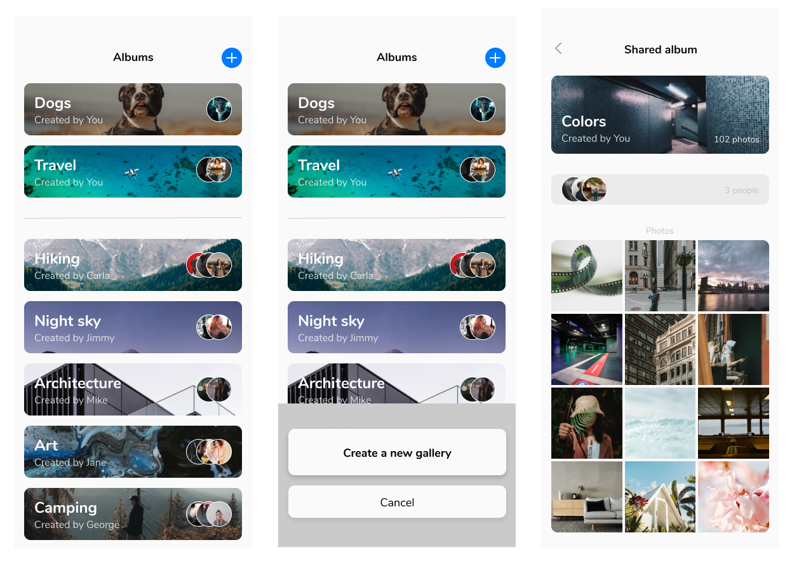

<h1 align="center">Photo Sharing App UI</h1>

### Accessing the code

- To get the *starter code*, clone the main branch.
- To get the *completed code*, clone the "completed" branch.

### Design

<a href="https://www.figma.com/file/jKrTKKXtPBuAsMAYePaKF7/Photo-Sharing-App-UI?node-id=0%3A1" target="_blank">Click here to view the Figma designs.</a>

### Mockup
